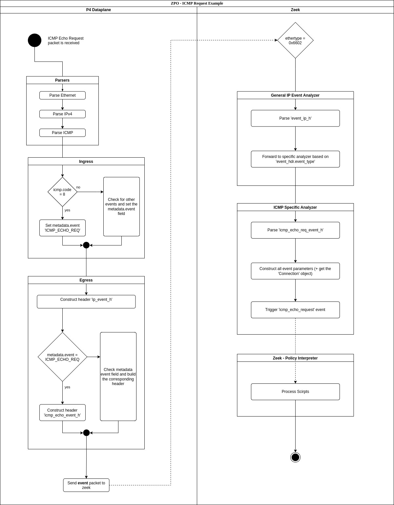

# ZPO 3

This is the same project as the **ZPO 2** project, but with IPv6 support.

This prototype aims to offload ICMP echo reply and request.

## Explanation

Here is a diagram of how a ICMP echo request is processed, from the dataplane, to the event
triggering in zeek.



## Findings during the development

- Analyse how to duplicate multiple times the packet to trigger multiple events.
    - Consider using 1 message for multiple events: TLV (Type Length Value), ASN1 (Abstract syntax notation)
- Check how to properly construct the `Connection` structure from zeek.
    - This seems to be a big problem...
- All zeek-like structures are now prefixed with `z_`.

## How to run

Clone git repo and switch to the right branch/tag, then:

```bash
# Enter project's root folder
cd zeek-p4/

# Init all submodules
./init-submodules

# Run p4app
./p4app run test-projects/zpo2/zpo.p4app

# Using a secondary terminal:

# Enter test-project's folder
cd test-projects/zpo2/

# Run zeek's docker (with p4 network attached)
./run_zeek

# In the running container: build, install and run zeek on the right interface
./run
```

In the `p4app` terminal window, run a ping:

```bash
h1 ping h2
```

You should see this results:

```
listening on s1-eth3

Initializing ZPO Script...
Registering PacketAnalyzer...
Registered PacketAnalyzer.
Initialized ZPO Plugin.

[ZPO] START AnalyzePacket!!! \/ \/ \/
[ZPO] |- src_addr = 10.0.0.10
[ZPO] |- dst_addr = 10.0.1.10
[ZPO] |- src_port = 8
[ZPO] |- dst_port = 0
[ZPO] |- l3_proto = 2048
[ZPO] |- l4_proto = 1
[ZPO] |- event_id = 2
[ZPO] END AnalyzePacket!!!   /\ /\ /\


[ZPO] START AnalyzePacket!!! \/ \/ \/
[ZPO] |- src_addr = 10.0.1.10
[ZPO] |- dst_addr = 10.0.0.10
[ZPO] |- src_port = 0
[ZPO] |- dst_port = 8
[ZPO] |- l3_proto = 2048
[ZPO] |- l4_proto = 1
[ZPO] |- event_id = 1
[ZPO] END AnalyzePacket!!!   /\ /\ /\
```

### Build docker images (optional)

If you don't want to download the images from dockerhub:

```bash

# Enter project's root folder
cd zeek-p4/

# Init all submodules
./init-submodules

# Build the 'base' and 'full' images:
./build-image base
./build-image full
```
